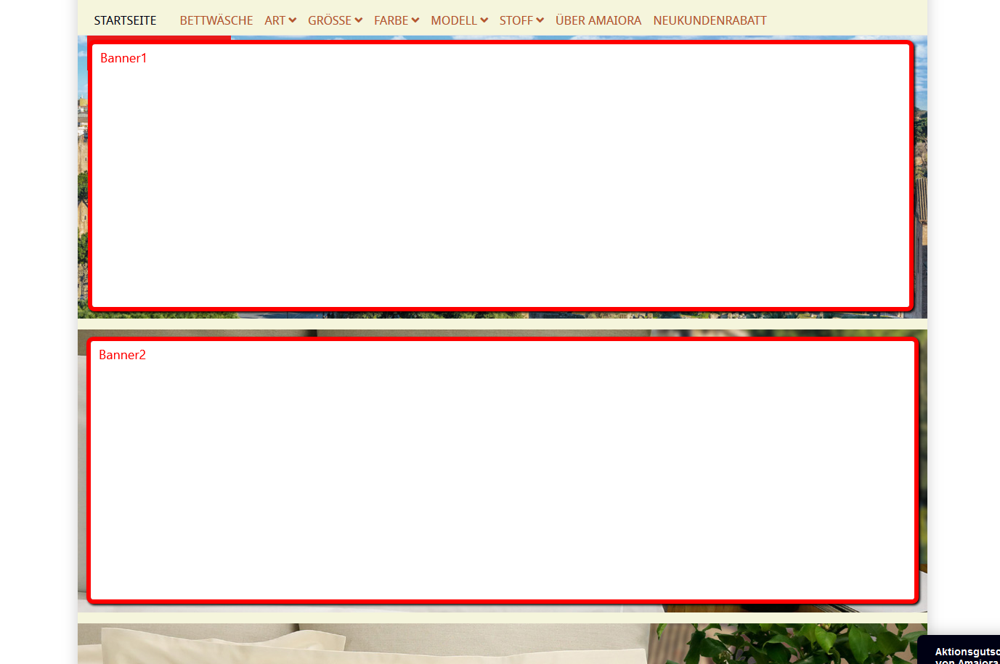
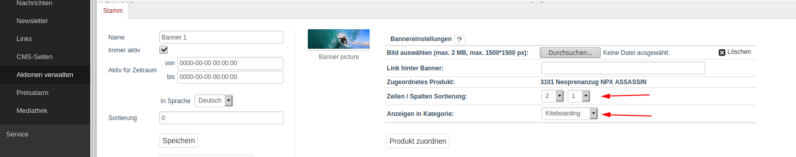

# Oxid banner

## Description

Instead of display the banner with a slider, you can change it into a banner wall.

If you create a new banner you can add them to a row/column.
The system try to display the banner at that position. It try
to fill from the top down, from the left to the right. The 
row/column will use for sorting. 

If the system detect more then one banner on the same place, the system display 
a slider (nivo-slider) to display the information there at the same place.

You can select a categorie or/and a content page where the system should display the banner. 
If no categorie/content page selected, the banner will display on the start page.

Module was created for Oxid 6.2, "Wave" Theme.

*New features:*

    * alternative title
    * alternative description
    * additional css class for banner caption
    * change default nivo slider settings

*Used third party modules:*

    https://github.com/Codeinwp/Nivo-Slider-jQuery
    https://docs.themeisle.com/article/487-nivo-slider-settings

    

## Install

1. Open the teminal in you oxid root directory (the "source" folder is a subfolder there and a "composer.json" shoud be there)

2. Execute following command within the terminal

        composer config repositories.rs/banner git https://github.com ThomasJanda/oxid-banner/
        composer require rs/banner:dev-master --update-no-dev --ignore-platform-reqs

3. The installation script will now ask some question if you like to override existing files. Type always "n" for "No" and hit enter for confirmation. 

4. Template changes

        File: /source/Application/views/wave/tpl/layout/page.tpl add new block "rs_banner"

            

                

                [{block name="rs_banner"}]
                [{if $oView->getClassName()=='start' && $oView->getBanners() && !empty($oView->getBanners())}]
                    [{include file="widget/promoslider.tpl"}]
                [{/if}]
                [{/block}]
            

        File: /var/www/html/oxid6_1_dev/source/Application/views/wave/tpl/page/info/content.tpl

            <h1 class="page-header">[{$template_title}]</h1>

            [{block name="rs_banner"}][{/block}]

            <article class="cmsContent">
                [{$oView->getParsedContent()}]
            </article>

        File: /var/www/html/oxid6_1_dev/source/Application/views/wave/tpl/page/list/list.tpl

                        <a class="rss" id="rssActiveCategory" aria-label="RSS Current Category" href="[{$rsslinks.activeCategory.link}]" title="[{$rsslinks.activeCategory.title}]" target="_blank">
                            <i class="fas fa-rss"></i>
                        </a>
                    [{/if}]
                </h1>
            

            [{block name="rs_banner"}][{/block}]

            [{assign var="oPageNavigation" value=$oView->getPageNavigation()}]
            [{if $actCategory && $actCategory->getShortDescription() && $oPageNavigation->actPage == 1}]
                

                    <em>[{$actCategory->oxcategories__oxdesc->rawValue}]</em>
                

            [{/if}]

5. Open the shop admin and enable module in the oxid admin area, Extensions => Modules